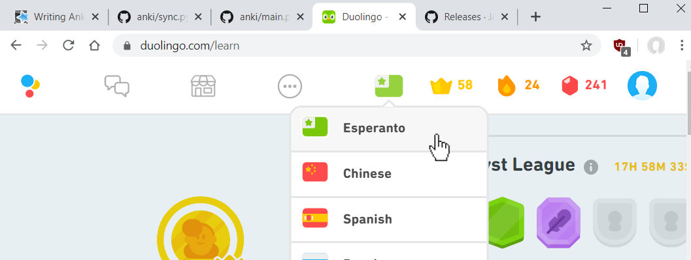
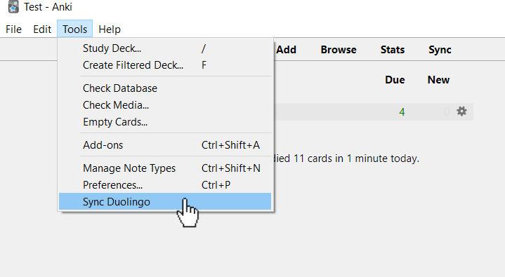

# AnkiSyncDuolingo
Pull your Duolingo vocabulary into Anki 2.1.

## Installing

### Manual

To install manually, download `duolingo_sync.ankiaddon` from the [latest release](https://github.com/JASchilz/AnkiSyncDuolingo/releases/latest/). You can then use Anki's `Tools` -> `Add-ons` -> `Install from file...` and select the `duolingo_sync.ankiaddon` file to install this plugin.

### Anki Addon Repository

Instructions to follow.

## Use

### Select Your Language in Duolingo

The `Duolingo Sync` plugin will download words from your *active* Duolingo language: whatever language you have most recently selected for learning. You can change your active language using the Duolingo mobile app or web application:

### Sync Duolingo

After installing the addon and restarting Anki, you can now select the `Sync Duolingo` dialog from the `Tools` menu in Anki:

If it's your first time using the addon, `Duolingo Sync` will ask your permission to create its custom note type. Then it will ask for your Duolingo credentials.

`Duolingo Sync` will only pull in Duolingo words that you've learned. As you learn more words in Duolingo, use the `Sync Duolingo` tool again to pull those new words into Anki.

### Managing Notes

`Duolingo Sync` will create cards into your `Default` deck. It will include helpful tags--including `duolingo_sync` and the name of the language--that you can use to sort your cards. Once these cards are created, you're welcome to move them into other decks or add additional tags.

### Editing Notes

By all means, edit the notes to your liking after they are imported into Anki. For example, you may wish to replace the text from your native-language with an image or images.

The only editing you _can't_ do is changing the `Gid` attribute or removing the `duolingo_sync` tag: the addon uses these to uniquely identify words from Duolingo and avoid importing a words into multiple notes.

## Etc.

### Improvements
See the [issues](https://github.com/JASchilz/AnkiSyncDuolingo/issues/) for the features I intend to add or fix. Feel free to add any issues you encounter.

### Acknowledgements
The connection to Duolingo's API is provided by [KartikTalwar's](https://github.com/KartikTalwar/) [Duolingo-API Python library](https://github.com/KartikTalwar/Duolingo/). Because of packaging requirements for Anki plugins, a modified version of that library is provided in this repository.

### Getting Involved
Feel free to open pull requests or issues. [GitHub](https://github.com/JASchilz/AnkiSyncDuolingo) is the canonical location of this project.

Here's the general sequence of events for code contribution:

1. Either:
    * Identify an existing issue in the [issue tracker](https://github.com/JASchilz/AnkiSyncDuolingo/issues/) and comment that you'd like to try to resolve it.
    * Open an issue in the [issue tracker](https://github.com/JASchilz/AnkiSyncDuolingo/issues/).
2. Get acknowledgement/concurrence.
3. Submit a pull request to resolve the issue. Include documentation, if appropriate.

